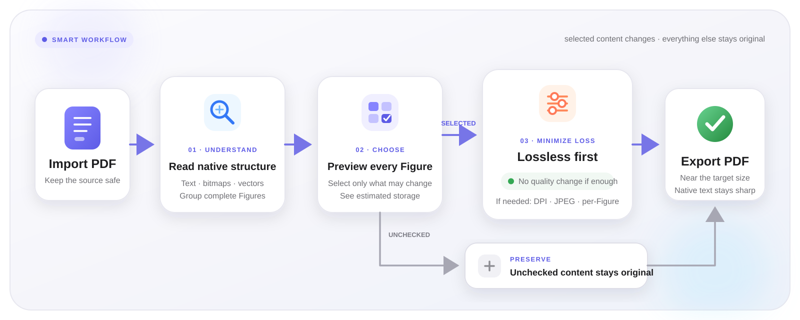

<div align="right">

**English** | [简体中文](README.zh-CN.md)

</div>

<div align="center">

# PDF Size Reducer

**Loss-minimizing PDF compression for everyday file-size limits**

When an assignment portal, application form, expense system, or submission site limits PDF size, there is no need to reopen Word, PowerPoint, or every source image. Choose the PDF, enter the required size, and decide which images may be reduced.

[](https://github.com/CBH2028/pdf-size-reducer/releases/latest)
[](https://github.com/CBH2028/pdf-size-reducer/stargazers)
[](#development-and-testing)
[](https://www.python.org/)
[](https://github.com/CBH2028/pdf-size-reducer/releases/latest)
[](LICENSE)

[Download for Windows](https://github.com/CBH2028/pdf-size-reducer/releases/latest) · [Changelog](CHANGELOG.md) · [Report an issue](https://github.com/CBH2028/pdf-size-reducer/issues)

</div>


## Operation demo

<div align="center">

[](https://github.com/CBH2028/pdf-size-reducer/releases/download/v3.2.0/PDF_Size_Reducer_Operation_Demo.mp4)

**A real 97.92 MiB / 48-page PDF: background scan → full-Figure preview → zoom → selective exclusion → exact target → completed output**

[Download HD MP4](https://github.com/CBH2028/pdf-size-reducer/releases/download/v3.2.0/PDF_Size_Reducer_Operation_Demo.mp4) · [Download demo PDF](https://github.com/CBH2028/pdf-size-reducer/releases/download/v3.2.0/PDF_Size_Reducer_Stress_Demo_97.92MB.pdf) · [Demo and stress-test notes](docs/DEMO.md)

</div>

## Why this tool exists

The PDF is often already finished when a website says it is too large. The usual choices are repetitive manual export work or whole-page rasterization that also blurs body text, equations, links, and captions.

PDF Size Reducer automates the careful route. It discovers complete figures, shows their previews and estimated storage, lets you choose only the images that may change, and searches for the clearest result that stays within the requested limit.

> **It does not rasterize every page.** Body text, equations, links, annotations, and unselected figures remain untouched. Text that can be recognized inside a selected figure is kept as a sharp, searchable, copyable PDF text layer.

Typical situations include:

- uploading homework, forms, portfolios, receipts, or certificates to a size-limited portal;
- submitting a report or paper without manually rebuilding its figures;
- reducing only the largest images while preserving important screenshots or diagrams;
- getting close to an exact MB or KB limit with the least practical visual loss.

## Important: possible black backgrounds in PowerPoint vector figures

Vector artwork exported from PowerPoint may contain complex transparency, masks, gradients, or grouped drawing objects. When the app reduces such a Figure, a small number of PDFs may render its background as solid black. This depends on the PDF drawing structure and viewer compatibility, so it cannot currently be ruled out for every PowerPoint-generated figure.

If this happens, **uncheck that Figure in the preview list and run the task again**. An unchecked Figure is preserved exactly as it appears in the source PDF; the app will reduce only the remaining selected images. Always give the output PDF a quick visual check before submitting it.

## Highlights

| Feature | What it does |
| --- | --- |
| Exact size target | Enter MB or KB. The app searches for the clearest result at or below the target instead of padding a file with meaningless bytes. |
| Loss-minimizing workflow | Lossless structural optimization is tried first. Image or Figure data is reduced only when lossless work cannot reach the target. |
| Complete Figure discovery | Captions such as `Fig. X`, `Figure X`, and `图 X` are used to group bitmaps, vector paths, arrows, and labels into one selectable item. |
| Visual selection | Browse full-view thumbnails, type, and estimated storage in the main window. Click any card for a zoomable preview rendered at about 240 DPI. |
| Clarity first | High resolution and moderate JPEG compression are preferred to protect small characters and thin lines. |
| Safe exclusion | If a figure is too important or shows a black-background issue, uncheck it. Its original PDF content and clarity are retained. |
| Responsive interface | Figure scanning and thumbnail rendering run in isolated processes. Large documents do not lock the main window and scanning can be stopped safely. |
| Polished desktop UI | Qt 6 cards, soft shadows, progressive thumbnails, high-DPI support, and warm animated feedback during scanning and HD preview generation. |

## Quick start

### Option 1: portable Windows build

Open [Releases](https://github.com/CBH2028/pdf-size-reducer/releases/latest), download `PDF_Size_Reducer.exe`, and run it. Python is not required.

### Option 2: run from source

```powershell
git clone https://github.com/CBH2028/pdf-size-reducer.git
cd pdf-size-reducer
py -3 -m venv .venv
.\.venv\Scripts\python.exe -m pip install -r requirements.txt
.\.venv\Scripts\python.exe qt_app.py
```

On Windows, `start_pdf_tool.bat` can also create the isolated environment, install dependencies, and start the app.

## How to use it

1. Click **Choose File**, or drag a PDF into the window.
2. Let the app discover figures page by page. The window remains responsive while it works.
3. Review each full-view thumbnail and estimated storage; click a thumbnail to zoom in.
4. Keep the images or Figures that may be reduced checked. Uncheck anything that must remain unchanged.
5. Enter the required target size, confirm the output location, and start compression.
6. Review the generated PDF. If a PowerPoint vector figure has a black background, uncheck it and run the task again.

The source PDF is never overwritten. If the selected output path already exists, the app asks before replacing it.

## How it works



- Lossless structural optimization runs first. If it is enough, image quality is not changed.
- Standalone bitmaps are re-encoded across candidate resolutions and JPEG quality levels.
- Selected complete Figures are searched between 180 and 720 DPI, while recognizable text stays in an upper PDF text layer.
- A 400-step quality scale, DPI search, and per-Figure tuning avoid large jumps such as only being able to produce 3.97 MB or 2.97 MB.
- If the target would require going below the 180 DPI clarity floor, the app reports the smallest safe result instead of silently producing unreadable content.

## Development and testing

```powershell
py -3 -m venv .venv
.\.venv\Scripts\python.exe -m pip install -r requirements-dev.txt
.\.venv\Scripts\python.exe -m pytest -q
.\.venv\Scripts\python.exe -m py_compile compressor.py qt_app.py
```

Run the reproducible large-file UI stress test:

```powershell
.\.venv\Scripts\python.exe .\tools\stress_test.py `
    --pages 48 --image-width 1600 --image-height 1000 `
    --vector-paths 90 --timeout 300
```

The command creates a temporary synthetic research-style PDF of about 98 MiB, monitors the Qt event loop, scanning, thumbnails, and memory, and removes the file afterward. Use `--pdf "D:\path\large.pdf"` to test an existing file or `--cancel-after-ms 500` to verify safe cancellation.

Build the single-file Windows executable with:

```powershell
.\build_exe.bat
```

The result is written to `dist\PDF_Size_Reducer.exe`.

## Project structure

```text
pdf-size-reducer/
├── qt_app.py              # Qt 6 desktop UI and background jobs
├── compressor.py          # Figure discovery, rendering, and targeting engine
├── tests/                 # Compression and content-preservation regressions
├── tools/stress_test.py   # Large-PDF generator and UI responsiveness test
├── tools/record_demo.py   # Reproducible, application-only demo recorder
├── docs/media/            # README animation and HD demo video
├── start_pdf_tool.bat     # One-click source launcher
├── build_exe.bat          # PyInstaller build script
└── CHANGELOG.md           # Full change history
```

MuPDF, Pillow, and Qt perform PDF rendering, pixel scaling, and JPEG encoding in native C/C++ code. Python coordinates the workflow, so rewriting only the outer application in C++ would provide limited improvement. Avoiding repeated candidates, reusing rendered data, and parallelizing independent figures are more valuable optimizations.

## Privacy

All PDFs are processed locally. The app does not upload documents and contains no telemetry, account system, or network analytics.

## Star history

<div align="center">

[](https://www.star-history.com/#CBH2028/pdf-size-reducer&Date)

</div>

The chart is generated online by Star History from public GitHub star data. Click it for details.

## Contributing

Issues and pull requests are welcome. Please read [CONTRIBUTING.md](CONTRIBUTING.md) before getting started. Important behavior changes are recorded in [CHANGELOG.md](CHANGELOG.md).

## License

Released under the [MIT License](LICENSE).
