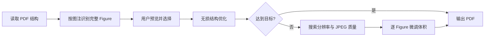

<div align="center">

# PDF Size Reducer

**面向论文与科研图表的精确定容 PDF 压缩工具**

在尽量保住小字符、细线和原生文字层的前提下，把 PDF 压到你指定的大小。

[](https://github.com/CBH2028/pdf-size-reducer/releases/latest)
[](https://github.com/CBH2028/pdf-size-reducer/stargazers)
[](#开发与测试)
[](https://www.python.org/)
[](https://github.com/CBH2028/pdf-size-reducer/releases/latest)
[](LICENSE)

[下载 Windows 版](https://github.com/CBH2028/pdf-size-reducer/releases/latest) · [查看修改日志](CHANGELOG.md) · [报告问题](https://github.com/CBH2028/pdf-size-reducer/issues)

</div>


## 为什么做这个工具

常见 PDF 压缩器会把整页降采样，论文正文、公式和图注也会一起变糊；简单地把图片放进 PowerPoint 再导出 PDF，质量通常不错，却需要逐张手工处理。PDF Size Reducer 将这个过程自动化：识别论文中的完整 Figure，只处理用户勾选的图形内容，并持续搜索最接近目标体积的高质量方案。

> **它不会把所有页面统一图像化。** 正文、公式、链接、批注以及未勾选的 Figure 保持原样；可识别的图内文字继续保留为清晰、可搜索、可复制的 PDF 文字。

## 功能亮点

| 功能 | 说明 |
| --- | --- |
| 精确定容 | 输入 MB 或 KB，自动寻找不超过目标大小且尽可能清晰的结果，不靠填充无意义字节伪造体积。 |
| 完整 Figure 识别 | 根据 `Fig. X`、`Figure X` 或 `图 X` 图注，把位图、矢量线条、箭头和文字组成的论文插图视为一个项目。 |
| 可视化选择 | 主界面直接显示双列全景缩略图、类型和估算占用；点击即可打开约 240 DPI 高清预览并平滑缩放。 |
| 清晰度优先 | 采用接近 PowerPoint 导出的高分辨率、适度 JPEG 压缩策略，优先保护小字符和细线。 |
| 透明背景安全 | Figure 替代图统一使用无 Alpha、无软蒙版的白底 RGB JPEG，避免部分阅读器出现黑色背景。 |
| Apple 风格界面 | Qt 6 圆角卡片、柔和阴影、缩略图淡入、高 DPI 适配，以及带呼吸光和动态文案的真实逐页加载进度。 |
| 始终可响应 | Figure 扫描、缩略图、高清预览和压缩均在后台线程执行，大型科研图表不会锁死主窗口。 |

## 快速开始

### 方式一：下载免安装版

前往 [Releases](https://github.com/CBH2028/pdf-size-reducer/releases/latest) 下载 `PDF_Size_Reducer.exe`，双击即可运行，无需安装 Python。

### 方式二：从源码运行

```powershell
git clone https://github.com/CBH2028/pdf-size-reducer.git
cd pdf-size-reducer
py -3 -m venv .venv
.\.venv\Scripts\python.exe -m pip install -r requirements.txt
.\.venv\Scripts\python.exe qt_app.py
```

也可以直接双击 `start_pdf_tool.bat`，脚本会自动创建独立环境并安装依赖。

## 使用方法

1. 点击“选择文件”，或把 PDF 拖入窗口；
2. 等待程序逐页识别 Figure；窗口在此期间仍可移动和响应；
3. 在右侧查看每个图形的全景缩略图与占用，点击缩略图可放大确认；
4. 勾选需要压缩的 Figure 或独立位图；
5. 输入目标大小，确认保存位置，点击“开始智能压缩”。

原 PDF 始终保持不变。如果输出文件已存在，程序会先询问是否覆盖。

## 工作原理



- 首先尝试无损结构优化；若已经达到目标，不改动图像质量。
- 独立位图会按候选分辨率和 JPEG 质量重新编码。
- 完整 Figure 的图形层会在 180–720 DPI 范围内搜索，可识别文字保留在上层。
- 400 级质量刻度配合 DPI 与单图微调，减少“只能得到 3.97 MB 或 2.97 MB”这类大跨度跳档。
- 如果目标小到无法维持 180 DPI，程序会报告当前内容可实现的最小大小，而不是继续输出难以辨认的结果。

## 开发与测试

```powershell
py -3 -m venv .venv
.\.venv\Scripts\python.exe -m pip install -r requirements-dev.txt
.\.venv\Scripts\python.exe -m pytest -q
.\.venv\Scripts\python.exe -m py_compile compressor.py qt_app.py
```

生成单文件 Windows 程序：

```powershell
.\build_exe.bat
```

构建结果位于 `dist\PDF_Size_Reducer.exe`。

## 项目结构

```text
pdf-size-reducer/
├── qt_app.py              # Qt 6 桌面界面与后台任务
├── compressor.py          # Figure 识别、渲染与精确定容引擎
├── tests/                 # 压缩与内容保真回归测试
├── start_pdf_tool.bat     # 一键启动脚本
├── build_exe.bat          # PyInstaller 构建脚本
└── CHANGELOG.md           # 完整修改日志
```

PDF 渲染、像素缩放和 JPEG 编码由 MuPDF、Pillow 与 Qt 的原生 C/C++ 核心完成。Python 负责流程编排，因此把外层全部重写为 C++ 对总体处理时间帮助有限；更有效的优化方向是减少重复候选、复用渲染结果和并行处理独立图形。

## 隐私

所有 PDF 均在本机处理，不会上传到服务器。本项目不包含遥测、账号系统或网络分析代码。

## Star History

<div align="center">

[](https://www.star-history.com/#CBH2028/pdf-size-reducer&Date)

</div>

曲线由 Star History 根据 GitHub Star 数据在线生成，点击图表可查看详情。

## 参与贡献

欢迎提交 Issue 或 Pull Request。开始前请阅读 [CONTRIBUTING.md](CONTRIBUTING.md)。重要行为变化会记录在 [CHANGELOG.md](CHANGELOG.md)。

## 许可证

本项目使用 [MIT License](LICENSE)。
