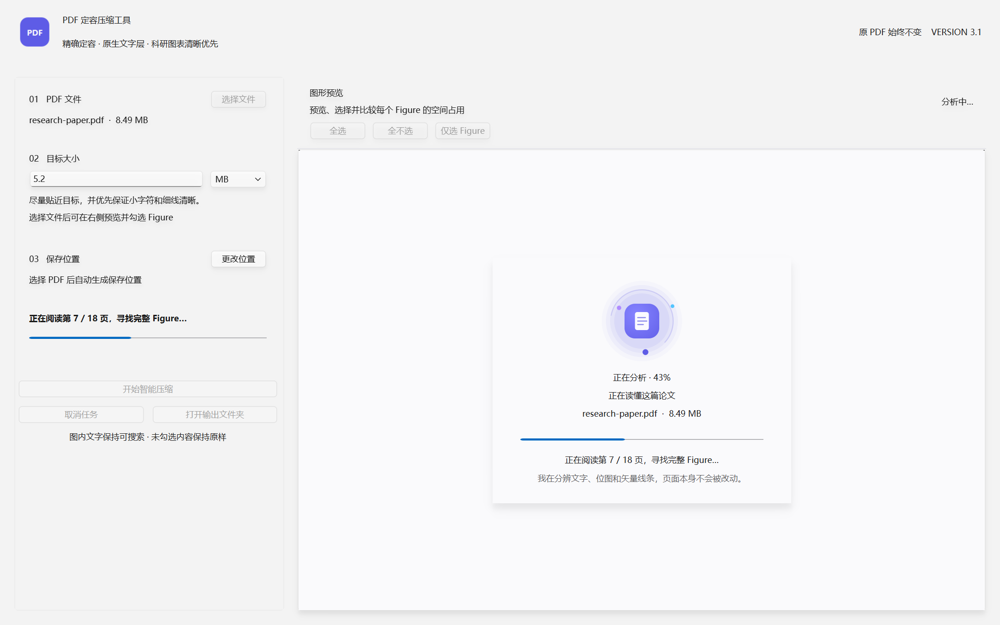
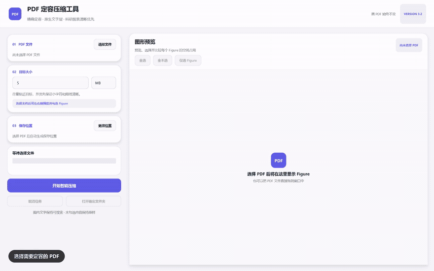
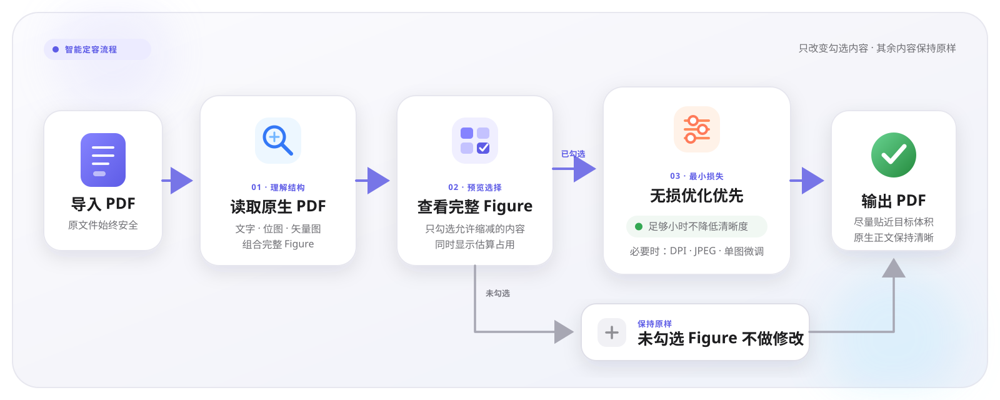
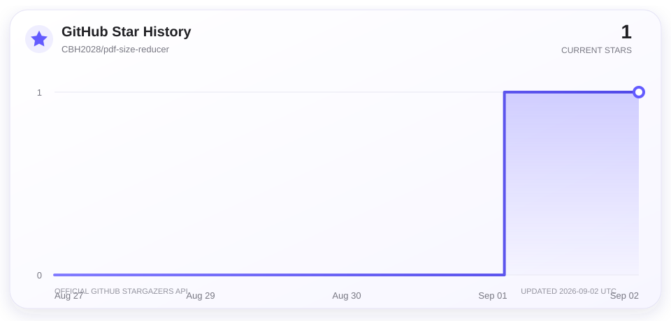

<div align="right">

[English](README.md) | **简体中文**

</div>

<div align="center">

# PDF Size Reducer

**面向日常 PDF 提交限制的最小损失定容压缩工具**

当作业、申请、报销、投稿或在线表单限制 PDF 大小时，不必重新编辑 Word、PPT 或原始图片：选择文件、输入目标大小，再决定哪些图片需要缩减即可。

[](https://github.com/CBH2028/pdf-size-reducer/releases/latest)
[](https://github.com/CBH2028/pdf-size-reducer/stargazers)
[](#开发与测试)
[](https://www.python.org/)
[](https://github.com/CBH2028/pdf-size-reducer/releases/latest)
[](LICENSE)

[下载 Windows 版](https://github.com/CBH2028/pdf-size-reducer/releases/latest) · [查看修改日志](CHANGELOG.md) · [报告问题](https://github.com/CBH2028/pdf-size-reducer/issues)

</div>



## 操作演示

<div align="center">

[](https://github.com/CBH2028/pdf-size-reducer/releases/download/v3.3.0/PDF_Size_Reducer_Operation_Demo.mp4)

**真实加载 97.92 MiB / 48 页 PDF：后台读取 → Figure 全景预览 → 放大检查 → 排除部分图形 → 精确输入目标 → 输出完成**

[下载高清 MP4](https://github.com/CBH2028/pdf-size-reducer/releases/download/v3.3.0/PDF_Size_Reducer_Operation_Demo.mp4) · [下载演示 PDF](https://github.com/CBH2028/pdf-size-reducer/releases/download/v3.2.0/PDF_Size_Reducer_Stress_Demo_97.92MB.pdf) · [查看演示与压力测试说明](docs/DEMO.zh-CN.md)

</div>

## 为什么做这个工具

生活中经常遇到“PDF 内容已经做好，但提交平台只允许几 MB”的情况。传统方法要反复降低图片质量、重新导出 PPT，或者把整份 PDF 转成图片；前者费时间，后者会让正文、公式和链接一起变糊。

PDF Size Reducer 尽量把这些工作自动化：识别 PDF 中的完整 Figure，显示每张图的预览和估算占用，让用户只选择真正需要缩减的图片，然后持续搜索最接近目标体积的高质量结果。

> **它不会把所有页面统一图像化。** 正文、公式、链接、批注以及未勾选的 Figure 保持原样；可识别的图内文字继续保留为清晰、可搜索、可复制的 PDF 文字。

## 使用前请注意：PPT 矢量图黑底风险

从 PowerPoint 导出的矢量图可能包含复杂的透明度、蒙版、渐变或组合对象。软件在降低这类 Figure 的占用时，少数 PDF 可能在输出结果中出现纯黑背景。这与原图的 PDF 绘制结构和阅读器兼容性有关，目前无法保证对所有 PPT 图形完全消除。

如果遇到黑色背景，请在主界面的 Figure 预览列表中**取消勾选这张图**，再重新处理。未勾选的 Figure 会保持原始内容和清晰度，软件只缩减其余选中的图片。建议提交前快速浏览一次输出 PDF。

## 功能亮点

| 功能 | 说明 |
| --- | --- |
| 精确定容 | 输入 MB 或 KB，自动寻找不超过目标大小且尽可能清晰的结果，不靠填充无意义字节伪造体积。 |
| 最小损失 | 首先尝试无损优化；只有达不到目标时才降低所选图片或 Figure 的数据量。 |
| 完整 Figure 识别 | 根据 `Fig. X`、`Figure X` 或 `图 X` 图注，把位图、矢量线条、箭头和文字组成的论文插图视为一个项目。 |
| 可视化选择 | 主界面直接显示双列全景缩略图、类型和估算占用；点击即可打开约 240 DPI 高清预览并平滑缩放。 |
| 清晰度优先 | 采用接近 PowerPoint 导出的高分辨率、适度 JPEG 压缩策略，优先保护小字符和细线。 |
| 黑底风险可规避 | 大多数透明 Figure 会转为白底 RGB；如复杂 PPT 矢量图仍出现黑底，可取消勾选该图并保持原样。 |
| 商业级桌面界面 | 玻璃感顶栏、结构化流程卡、动态状态灯、渐变主操作、缩略图淡入、悬停光影、惯性平滑滚动和高 DPI 适配。 |
| 始终可响应 | Figure 扫描与缩略图渲染使用隔离子进程，高清预览和压缩使用后台任务；大型科研图表不会锁死主窗口，并可随时停止读取。 |
| C++ 高速规划器 | C++17/MuPDF worker 从一次母版光栅化生成每张 Figure 的完整质量阶梯，再由全局预算规划器选择最清晰的组合。 |

## 快速开始

### 方式一：下载免安装版

前往 [Releases](https://github.com/CBH2028/pdf-size-reducer/releases/latest) 下载 `PDF_Size_Reducer.exe`，双击即可运行，无需安装 Python。

### 方式二：从源码运行

```powershell
git clone https://github.com/CBH2028/pdf-size-reducer.git
cd pdf-size-reducer
py -3 -m venv .venv
.\.venv\Scripts\python.exe -m pip install -r requirements.txt
.\.venv\Scripts\python.exe qt_app.py
```

也可以直接双击 `start_pdf_tool.bat`，脚本会自动创建独立环境并安装依赖。

## 使用方法

1. 点击“选择文件”，或把 PDF 拖入窗口；
2. 等待程序逐页识别 Figure；窗口在此期间仍可移动和响应；
3. 在右侧查看每个图形的全景缩略图与占用，点击缩略图可放大确认；
4. 勾选需要缩减的 Figure 或独立位图；不希望修改的图片取消勾选；
5. 输入目标大小，确认保存位置，点击“开始智能压缩”；
6. 提交前浏览输出 PDF；若某张 PPT 矢量图出现黑底，取消勾选它后重新处理。

原 PDF 始终保持不变。如果输出文件已存在，程序会先询问是否覆盖。

## 工作原理



- 首先尝试无损结构优化；若已经达到目标，不改动图像质量。
- 独立位图会编码成紧凑的分辨率与 JPEG 质量阶梯。
- C++ worker 以 720 DPI 对每张完整 Figure 只做一次母版光栅化，再从母版生成低 DPI 版本；可识别文字仍保留在上层。
- 全局率失真规划器把可用字节分配给所有已选资源，通常只需装配两个完整候选 PDF。
- 如果目标小到无法维持 180 DPI，程序会报告当前内容可实现的最小大小，而不是继续输出难以辨认的结果。

## 开发与测试

```powershell
py -3 -m venv .venv
.\.venv\Scripts\python.exe -m pip install -r requirements-dev.txt
.\.venv\Scripts\python.exe -m pytest -q
.\.venv\Scripts\python.exe -m py_compile compressor.py qt_app.py
native_worker\build.bat
```

运行可重复的大文件界面压力测试：

```powershell
.\.venv\Scripts\python.exe .\tools\stress_test.py `
    --pages 48 --image-width 1600 --image-height 1000 `
    --vector-paths 90 --timeout 300
```

该命令会临时生成约 98 MB 的合成科研 PDF，监测 Qt 事件循环、扫描、缩略图和内存指标，结束后自动删除测试文件。也可以用 `--pdf "D:\path\large.pdf"` 测试已有文件，或用 `--cancel-after-ms 500` 验证安全取消。

使用 [`tools/benchmark_suite.py`](tools/benchmark_suite.py) 可运行完整的固定语料性能与画质基准。脚本在对比前会核对文件哈希，并记录定容误差、渲染缓存命中、内存、PSNR、边缘相似度、原生文字保留和黑背景回归。详见[基准说明](benchmarks/README.md)和[最新实测结果](benchmarks/RESULTS.md)。

生成单文件 Windows 程序：

```powershell
.\build_exe.bat
```

构建结果位于 `dist\PDF_Size_Reducer.exe`。

## 项目结构

```text
pdf-size-reducer/
├── qt_app.py              # Qt 6 桌面界面与后台任务
├── compressor.py          # Figure 识别、渲染与精确定容引擎
├── native_worker.py       # 版本协议、安全取消与自动回退桥接
├── native_worker/         # 独立 C++17/MuPDF 高速 worker
├── tests/                 # 压缩与内容保真回归测试
├── benchmarks/            # 固定基线、运行说明与实测结果
├── tools/benchmark_suite.py # 性能、定容与画质基准
├── tools/stress_test.py   # 大型 PDF 生成与界面响应压力测试
├── tools/record_demo.py   # 驱动真实界面并安全录制操作演示
├── docs/media/            # README 动图与高清操作视频
├── start_pdf_tool.bat     # 一键启动脚本
├── build_exe.bat          # PyInstaller 构建脚本
└── CHANGELOG.md           # 完整修改日志
```

PDF 的图形选择、结构保护、安全控制和回退逻辑继续由 Python 负责。C++17 worker 的协议 2 会从一次高分辨率母版生成整条 Figure 质量阶梯，全局率失真规划器随后统一分配字节预算，避免反复重写整个 PDF。固定 `Automatica.pdf → 3.12 MiB` 基准从 v3.3.1 的 169.964 秒、v3.4.0 的 33.074 秒进一步缩短到 **9.501 秒**，相比分别达到 **17.889 倍**和 **3.481 倍加速**。输出比目标小 809 字节，原生文字完全保留，对源文件 PSNR 为 39.854 dB，并通过黑背景检测。详见[实测基准](benchmarks/RESULTS.md)。

C++ worker 是可选加速层：源码环境未构建或 worker 异常时会自动回退到原有 Python/MuPDF 引擎；Windows 打包版会自动内置。`build_exe.bat` 同时生成 `dist\PDF_Fast_Worker` 独立 worker 文件夹和可直接分发的 `dist\PDF_Fast_Worker_Windows_x64.zip`。

## 隐私

所有 PDF 均在本机处理，不会上传到服务器。本项目不包含遥测、账号系统或网络分析代码。

## Star History

<div align="center">

[](https://github.com/CBH2028/pdf-size-reducer/stargazers)

</div>

曲线存放在仓库内，并通过 GitHub 官方 Stargazers API 生成，不再受第三方图表服务故障影响。点击图表可查看实时 Star 用户列表；维护者可运行 `python tools/update_star_history.py` 刷新曲线。

## 参与贡献

欢迎提交 Issue 或 Pull Request。开始前请阅读 [CONTRIBUTING.md](CONTRIBUTING.md)。重要行为变化会记录在 [CHANGELOG.md](CHANGELOG.md)。

## 许可证

本项目使用 [MIT License](LICENSE)。
