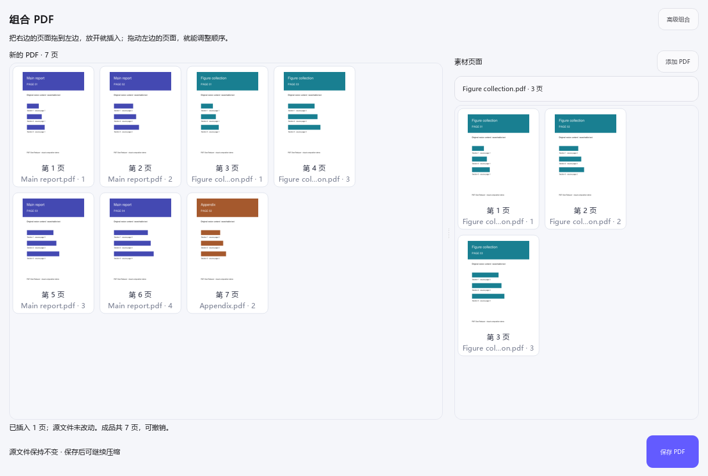
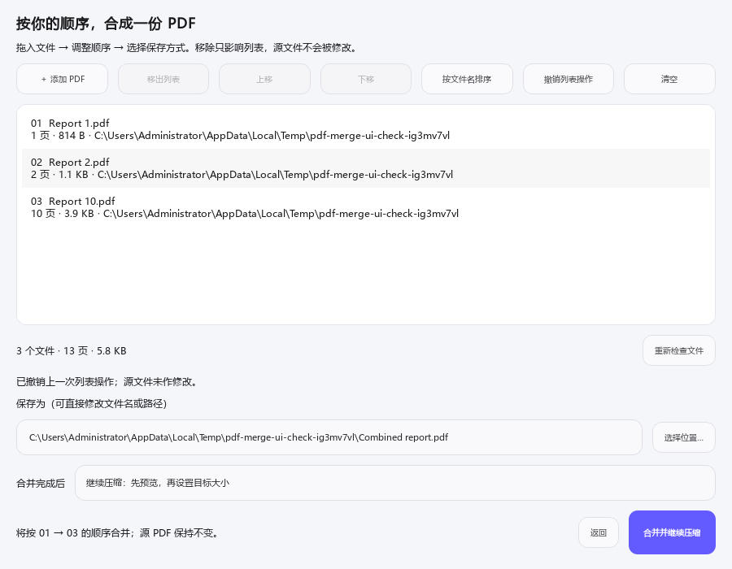

<div align="right">

[English](README.md) | **简体中文**

</div>

<div align="center">

# PDF Size Reducer

**可视化 PDF 合成、高清图导出与最小损失定容压缩工具**

当作业、申请、报销、投稿或在线表单限制 PDF 大小时，不必重新编辑 Word、PPT 或原始图片：选择文件、输入目标大小，再决定哪些图片需要缩减即可。

[](https://github.com/CBH2028/pdf-size-reducer/releases/latest)
[](https://github.com/CBH2028/pdf-size-reducer/stargazers)
[](#开发与测试)
[](https://www.python.org/)
[](https://github.com/CBH2028/pdf-size-reducer/releases/latest)
[](LICENSE)

[下载 Windows 版](https://github.com/CBH2028/pdf-size-reducer/releases/latest) · [查看修改日志](CHANGELOG.md) · [报告问题](https://github.com/CBH2028/pdf-size-reducer/issues)

</div>


## 操作演示

<div align="center">

[](https://github.com/CBH2028/pdf-size-reducer/releases/download/v3.3.0/PDF_Size_Reducer_Operation_Demo.mp4)

**真实加载 97.92 MiB / 48 页 PDF：后台读取 → Figure 全景预览 → 放大检查 → 排除部分图形 → 精确输入目标 → 输出完成**

[下载高清 MP4](https://github.com/CBH2028/pdf-size-reducer/releases/download/v3.3.0/PDF_Size_Reducer_Operation_Demo.mp4) · [下载演示 PDF](https://github.com/CBH2028/pdf-size-reducer/releases/download/v3.2.0/PDF_Size_Reducer_Stress_Demo_97.92MB.pdf) · [查看演示与压力测试说明](docs/DEMO.zh-CN.md)

</div>

## 为什么做这个工具

生活中经常遇到“PDF 内容已经做好，但提交平台只允许几 MB”的情况。传统方法要反复降低图片质量、重新导出 PPT，或者把整份 PDF 转成图片；前者费时间，后者会让正文、公式和链接一起变糊。

PDF Size Reducer 尽量把这些工作自动化：识别 PDF 中的完整 Figure，显示每张图的预览和估算占用，让用户只选择真正需要缩减的图片，然后持续搜索最接近目标体积的高质量结果。

> **它不会把所有页面统一图像化。** 正文、公式、链接、批注以及未勾选的 Figure 保持原样；可识别的图内文字继续保留为清晰、可搜索、可复制的 PDF 文字。

## 使用前请注意：PPT 矢量图黑底风险

从 PowerPoint 导出的矢量图可能包含复杂的透明度、蒙版、渐变或组合对象。软件在降低这类 Figure 的占用时，少数 PDF 可能在输出结果中出现纯黑背景。这与原图的 PDF 绘制结构和阅读器兼容性有关，目前无法保证对所有 PPT 图形完全消除。

如果遇到黑色背景，请在主界面的 Figure 预览列表中**取消勾选这张图**，再重新处理。未勾选的 Figure 会保持原始内容和清晰度，软件只缩减其余选中的图片。建议提交前快速浏览一次输出 PDF。

## 功能亮点

| 功能 | 说明 |
| --- | --- |
| 普通组合，直接拖动 | 左侧成品、右侧素材；拖入页面就插入，拖动成品页就排序，最后保存。默认界面不显示树、页码输入和插入按钮。 |
| 高级组合，按需展开 | 合成树、嵌套分组、页码范围和更多按钮收进高级模式；两种模式共用方案和撤销历史，切换不丢内容。 |
| 整份合并移入高级模式 | 在高级组合中打开整份文件队列，支持多选排序、文件名自然排序、撤销及页数/体积统计。 |
| 合成后压缩 | 按树形方案复制原始 PDF 页面，不把文字变成图片；生成后可继续定容压缩。符合条件的整份文件方案继续使用原生加速合并。 |
| 导出已选高清图 | 先在预览区勾选确实需要的 Figure/图片，再自由组合 SVG、600 DPI PNG、单图单页 PDF；未勾选图形不会导出。 |
| 精确定容 | 输入 MB 或 KB，自动寻找不超过目标大小且尽可能清晰的结果，不靠填充无意义字节伪造体积。 |
| 最小损失 | 首先尝试无损优化；只有达不到目标时才降低所选图片或 Figure 的数据量。 |
| 完整 Figure 识别 | 根据 `Fig. X`、`Figure X` 或 `图 X` 图注，把位图、矢量线条、箭头和文字组成的论文插图视为一个项目。 |
| 可视化选择 | 主界面直接显示双列全景缩略图、类型和估算占用；点击即可打开约 240 DPI 高清预览并平滑缩放。 |
| 清晰度优先 | 采用接近 PowerPoint 导出的高分辨率、适度 JPEG 压缩策略，优先保护小字符和细线。 |
| 黑底风险可规避 | 大多数透明 Figure 会转为白底 RGB；如复杂 PPT 矢量图仍出现黑底，可取消勾选该图并保持原样。 |
| 商业级桌面界面 | 玻璃感顶栏、结构化流程卡、动态状态灯、渐变主操作、缩略图淡入、悬停光影、惯性平滑滚动和高 DPI 适配。 |
| 始终可响应 | 扫描、缩略图、高清预览、合并和压缩均在独立进程执行。关闭预览会取消渲染；压缩或合并取消后若后台仍无响应，会在宽限期结束后停止该任务的进程树。 |
| 启动立即有动态反馈 | Windows 单文件解包阶段先显示实时加载状态，随后无缝切换为脉冲光环、旋转进度和移动光带动画，直到主工作区可以操作。 |
| C++ 高速规划器 | C++17/MuPDF worker 从一次母版光栅化生成每张 Figure 的完整质量阶梯，再由全局预算规划器选择最清晰的组合。 |
| 加固的原生边界 | Rust 守卫以内存安全的方式解析请求，核验原生后端和 DLL，将任务限制在私有工作区，并施加 Windows 进程与内存限制。 |

## 快速开始

### 方式一：下载免安装版

前往 [Releases](https://github.com/CBH2028/pdf-size-reducer/releases/latest) 下载 `PDF_Size_Reducer.exe`，双击即可运行，无需安装 Python。
v3.6 及后续版本还会提供 `SHA256SUMS.txt`，用于核对下载文件完整性。

### 方式二：从源码运行

```powershell
git clone https://github.com/CBH2028/pdf-size-reducer.git
cd pdf-size-reducer
py -3 -m venv .venv
.\.venv\Scripts\python.exe -m pip install -r requirements.txt
.\.venv\Scripts\python.exe qt_app.py
```

也可以直接双击 `start_pdf_tool.bat`，脚本会自动创建独立环境并安装依赖。

## 使用方法

1. 点击“选择文件”，或把 PDF 拖入窗口；
2. 等待程序逐页识别 Figure；窗口在此期间仍可移动和响应；
3. 在右侧查看每个图形的全景缩略图与占用，点击缩略图可放大确认；
4. 勾选需要缩减的 Figure 或独立位图；不希望修改的图片取消勾选；
5. 输入目标大小，确认保存位置，点击“开始智能压缩”；
6. 提交前浏览输出 PDF；若某张 PPT 矢量图出现黑底，取消勾选它后重新处理。

原 PDF 始终保持不变。如果输出文件已存在，程序会先询问是否覆盖。

如果源 PDF 在扫描后被其他程序保存或替换，请重新加载再进行压缩，避免旧的图形选择对应到新内容。桌面任务先在临时工作区生成结果，主程序确认成功且未取消后才保存到最终位置；取消或后台崩溃时，已有输出不会被半成品替换。

### 导出已选高清图

1. 加载 PDF，等待 Figure 识别完成，并在右侧准确勾选需要导出的 Figure/图片；全不选时导出按钮会禁用；
2. 点击“导出已选高清图…”，通过格式勾选框选择 SVG、PNG、PDF 中的一种或多种格式；至少选择一种；
3. 选择父文件夹。软件会自动新建 `<PDF 文件名>_高清图` 目录，已有同名目录不会被覆盖，并且只写出已勾选的格式；
4. 需要核对来源时查看 `manifest.json`，其中列出用户选择的格式、每一项的原页码、尺寸、输出文件，以及内容是保留原生矢量还是无损嵌入原位图。

完整 Figure 的 SVG/PDF 不会被整张拍平：原 PDF 路径继续保持矢量，SVG 文字输出为轮廓，PDF 文字保持原生；Figure PNG 最高按 600 DPI 渲染。Figure 内原本就是照片的部分继续保持原像素图层。独立位图无法在不描摹、不改变外观的前提下凭空变成真矢量，因此三种容器格式都会保留其原始像素，并如实标记为位图嵌入。最终导出项目数始终与右侧已勾选项目数一致，未勾选项目不会进入导出目录。

### 普通组合：直接拖动页面

v3.13.1 已修复 v3.13.0 拖动后松开不生效的问题。请运行更新后的 EXE，已经打开的旧窗口不会自动更新。

1. 点击“组合 PDF · 拖动页面即可”。工作区已有 PDF 时，它的页面会显示在左侧；空白组合窗口可以直接把主 PDF 拖到左边，其余文件进入素材库。
2. 把素材 PDF 拖到**右侧**，或点击“添加 PDF”。用下拉框切换素材，把需要的页面拖到**左侧页面之间**，按彩色插入线的位置松开即可。添加素材不会自动把整份文件拼进去。
3. 拖动左侧页面就能调整顺序；Ctrl / Shift 可多选。悬停时点 **×** 或按 Delete 只从成品方案中移出页面；Ctrl+Z 撤销，Ctrl+Shift+Z / Ctrl+Y 重做。双击页面可放大。
4. 点击“保存 PDF”，选择新文件名。取消保存不会丢掉排列好的内容。默认保存后进入压缩预览，按需设置目标大小再压缩。



合成树、嵌套分组/书签、页码输入、插入按钮、重新检查、只保存选项和整份合并都收进了“高级组合”。来回切换保留原方案、分组和撤销历史。[查看高级合成树界面](docs/images/pdf-composer.png)。

素材库无固定文件数量上限。普通模式连续滚动并按需加载缩略图，高级模式保留每组 24 页的浏览方式；单次输出最多 20,000 页、树最多 12 层、单文件不超过 4 GiB、实际使用的源 PDF 合计不超过 16 GiB。内容保留及内部链接限制见[合成指南（英文）](docs/COMPOSING.md)。

### 整份合并（高级组合中）

1. 打开“组合 PDF → 高级组合 → 整份合并…”。素材库文件会带入队列；取消后回到原组合方案，完成则保存整个队列中的文件，而不是当前选页方案；
2. 可以继续将 PDF 直接拖入合并列表，查看各文件的页数、体积、所在目录及总计；双击文件可用默认 PDF 阅读器查看；
3. 拖动调整顺序，或用 Ctrl / Shift 多选后通过“上移 / 下移”（Alt+↑/↓）整组移动。“按文件名排序”会按 `1、2、10` 自然排序。移出、清空只影响列表，不删除原文件；误操作可以“撤销列表操作”；
4. 修改自动建议的文件名或选择其他保存位置。默认名称会避开已有文件；覆盖确认选“否”时保留当前列表，可改名后继续；
5. 选择“继续压缩：先预览，再设置目标大小”，点击“合并并继续压缩”。合并文件读取完成后，预览并勾选 Figure，设置 MB 或 KB 目标，再开始压缩。压缩结果另存，合并文件也会保留。

如果只需合并，选择“只合并，保存 PDF”。重复文件和无效路径会提示跳过；后台检查会标出不可读取或受密码保护的文件。源文件有变化时，点击“重新检查文件”后再确认。整份队列一次最多 100 个 PDF、单文件不超过 4 GiB、总输入不超过 16 GiB；素材库较大时请确认实际带入的队列。



匹配协议 3 worker 时，合并由 Rust 守卫和 C++17/MuPDF 后端完成；worker 缺失或不兼容时自动回退到 Python/PyMuPDF。两条路径都在独立进程中执行并支持取消，完整结果经过页数和页面读取校验后才写入最终位置。页面文字、尺寸、旋转、普通页面链接、批注和书签目标会保留；受密码保护的文件需要先解密。

包含可编辑 AcroForm 表单的文件会自动使用兼容合并路径，保留字段值及可编辑性。原生合并也会正确保留旋转页面上的普通链接，以及位置重叠但目标不同的链接。

合并以页面为单位，不保证保留文档级附件、PDF 文件包、数字签名和命名目标。合并文件的基本元数据取自第一份 PDF。

## 工作原理


- 首先尝试无损结构优化；若已经达到目标，不改动图像质量。
- 独立位图会编码成紧凑的分辨率与 JPEG 质量阶梯。
- C++ worker 以 720 DPI 对每张完整 Figure 只做一次母版光栅化，再从母版生成低 DPI 版本；可识别文字仍保留在上层。
- 全局率失真规划器把可用字节分配给所有已选资源，通常只需装配两个完整候选 PDF。
- 如果目标小到无法维持 180 DPI，程序会报告当前内容可实现的最小大小，而不是继续输出难以辨认的结果。

文字编辑、文字自动分区编辑和新增文字仍未恢复。现在的选页、插页、移出页面只用于生成新的合成 PDF，不修改原文件。压缩用的 Figure 自动识别、预览与勾选仍然保留。

## 开发与测试

```powershell
py -3 -m venv .venv
.\.venv\Scripts\python.exe -m pip install -r requirements-dev.txt
.\.venv\Scripts\python.exe -m pytest -q
.\.venv\Scripts\python.exe -m py_compile compressor.py graphics_export.py qt_app.py merge_ui.py pdf_composer.py composer_ui.py qt_dispatch.py tools\generate_startup_splash.py
# 需要通过 rustup 安装 stable Rust，并安装 Visual Studio 2022 C++ Build Tools。
native_worker\build.bat
.\.venv\Scripts\python.exe qt_app.py --graphics-export-self-test
.\.venv\Scripts\python.exe qt_app.py --startup-self-test
```

运行可重复的大文件界面压力测试：

```powershell
.\.venv\Scripts\python.exe .\tools\stress_test.py `
    --pages 48 --image-width 1600 --image-height 1000 `
    --vector-paths 90 --timeout 300
```

该命令会临时生成约 98 MB 的合成科研 PDF，监测 Qt 事件循环、扫描、缩略图和内存指标，结束后自动删除测试文件。也可以用 `--pdf "D:\path\large.pdf"` 测试已有文件，或用 `--cancel-after-ms 500` 验证安全取消。

使用 [`tools/benchmark_suite.py`](tools/benchmark_suite.py) 可运行完整的固定语料性能与画质基准。脚本在对比前会核对文件哈希，并记录定容误差、渲染缓存命中、内存、PSNR、边缘相似度、原生文字保留和黑背景回归。详见[基准说明](benchmarks/README.md)和[最新实测结果](benchmarks/RESULTS.md)。

生成单文件 Windows 程序：

```powershell
.\build_exe.bat
```

构建结果位于 `dist\PDF_Size_Reducer.exe`。

`--simple-composer-self-test` 检查普通拖放组合及实际导出；`--composer-self-test` 检查高级合成树。另有 `--merge-ui-self-test`、`--workflow-self-test` 和 `--native-worker-self-test` 检查整份合并、压缩及加速器发现。

## 项目结构

```text
pdf-size-reducer/
├── qt_app.py              # Qt 6 桌面界面与后台任务
├── compressor.py          # Figure 识别、渲染与精确定容引擎
├── native_worker.py       # 版本协议、安全取消与自动回退桥接
├── native_worker/         # Rust 守卫与 C++17/MuPDF 高速后端
├── SECURITY.md            # 原生 worker 威胁模型与漏洞报告策略
├── tests/                 # 压缩与内容保真回归测试
├── benchmarks/            # 固定基线、运行说明与实测结果
├── tools/benchmark_suite.py # 性能、定容与画质基准
├── tools/stress_test.py   # 大型 PDF 生成与界面响应压力测试
├── tools/record_demo.py   # 驱动真实界面并安全录制操作演示
├── docs/media/            # README 动图与高清操作视频
├── start_pdf_tool.bat     # 一键启动脚本
├── build_exe.bat          # PyInstaller 构建脚本
└── CHANGELOG.md           # 完整修改日志
```

PDF 的图形选择、结构保护、安全控制和回退逻辑继续由 Python 负责。C++17 worker 的协议 3 支持加固的页面合并，并会从一次高分辨率母版生成整条 Figure 质量阶梯；全局率失真规划器随后统一分配字节预算，避免反复重写整个 PDF。固定 `Automatica.pdf → 3.12 MiB` 基准从 v3.3.1 的 169.964 秒、v3.4.0 的 33.074 秒进一步缩短到 **9.501 秒**，相比分别达到 **17.889 倍**和 **3.481 倍加速**。输出比目标小 809 字节，原生文字完全保留，对源文件 PSNR 为 39.854 dB，并通过黑背景检测。详见[实测基准](benchmarks/RESULTS.md)。

C++ worker 是可选加速层：源码环境未构建或 worker 异常时会自动回退到原有 Python/MuPDF 引擎；Windows 打包版会自动内置。Python 只启动零第三方 crate 依赖的 Rust 守卫，由守卫核验并约束 C++ 后端后再渲染或合并文档。原生合并强化的是执行边界，不宣称快于 PyMuPDF 已经原生实现的 `insert_pdf`；主要实测加速仍来自合并后自动使用的压缩规划器。完整能力边界与限制见[安全策略](SECURITY.md)。`build_exe.bat` 同时生成 `dist\PDF_Fast_Worker` 独立 worker 文件夹和可直接分发的 `dist\PDF_Fast_Worker_Windows_x64.zip`。

## 隐私

所有 PDF 均在本机处理，不会上传到服务器。本项目不包含遥测、账号系统或网络分析代码。

## Star History

<div align="center">

[](https://github.com/CBH2028/pdf-size-reducer/stargazers)

</div>

曲线存放在仓库内，并通过 GitHub 官方 Stargazers API 生成，不再受第三方图表服务故障影响。点击图表可查看实时 Star 用户列表；维护者可运行 `python tools/update_star_history.py` 刷新曲线。

## 参与贡献

欢迎提交 Issue 或 Pull Request。开始前请阅读 [CONTRIBUTING.md](CONTRIBUTING.md)。重要行为变化会记录在 [CHANGELOG.md](CHANGELOG.md)。

## 许可证

本项目使用 [MIT License](LICENSE)。
